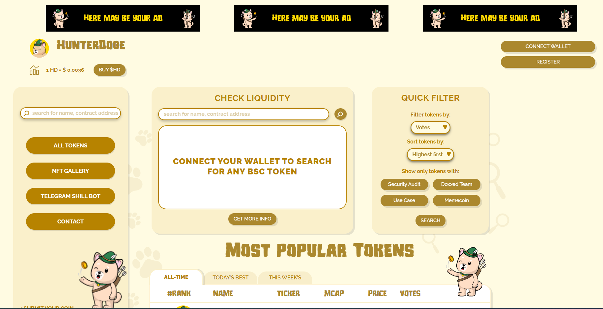
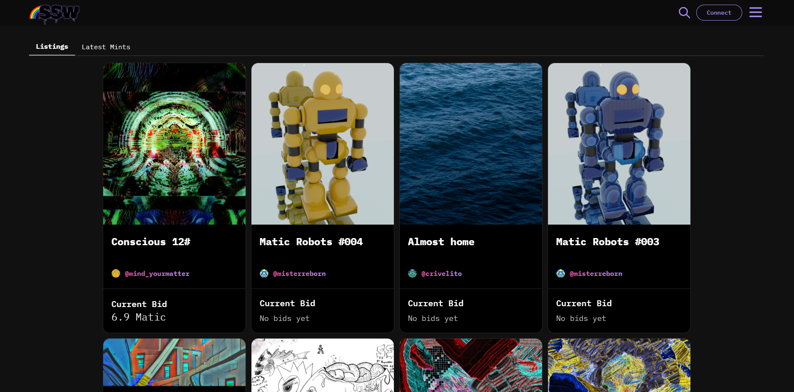
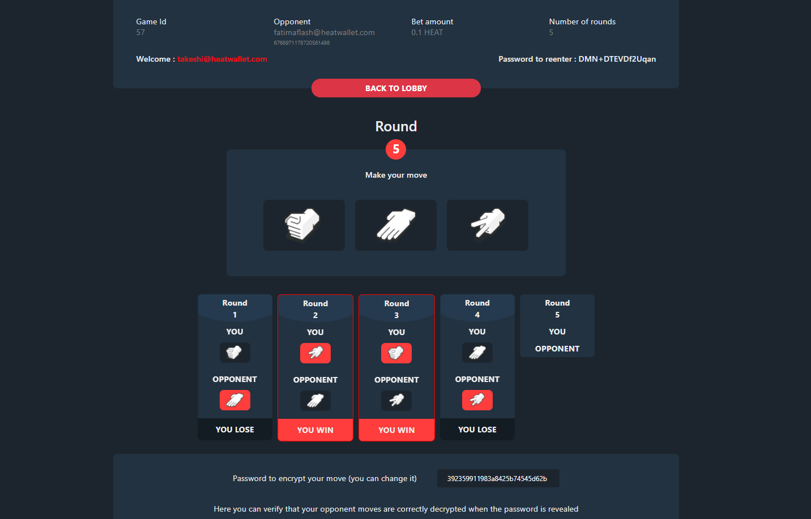
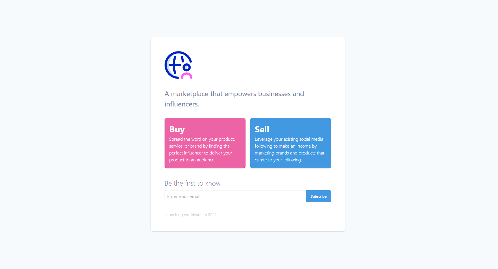
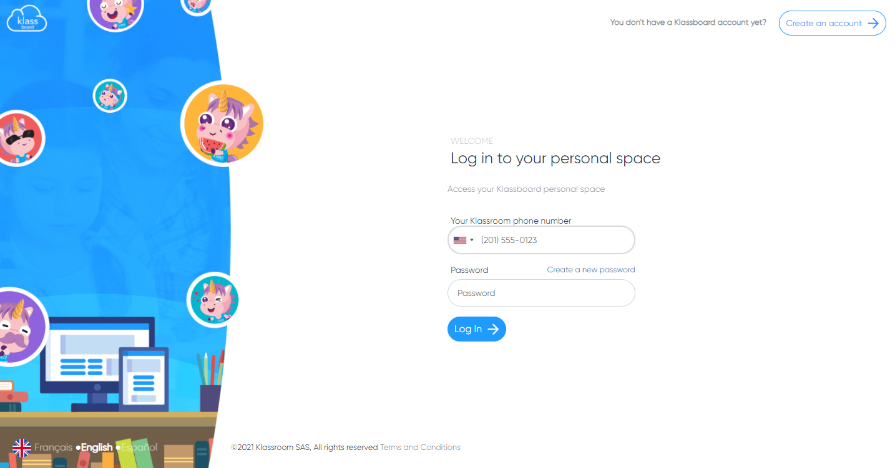
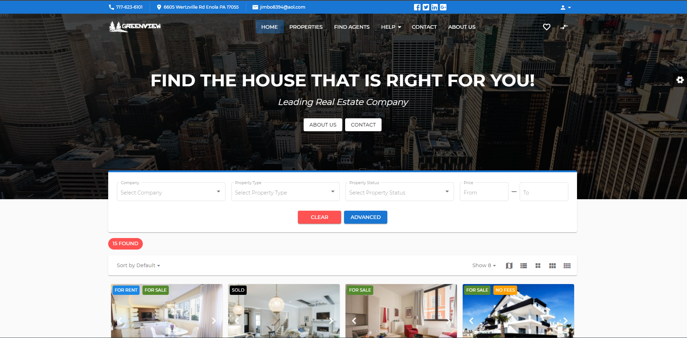
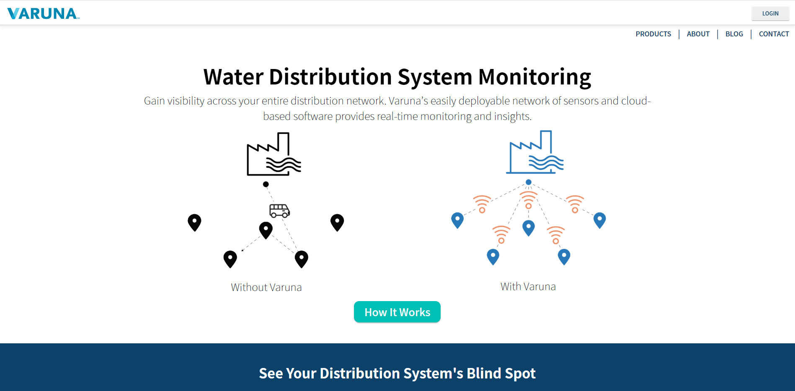

<h1 align="center" > 
  

</h1>  

### 𝐒𝐤𝐢𝐥𝐥s
<table>
  <tr>
      <td></td>
      <td></td>
      <td></td>
      <td></td>
      <td></td>
      <td></td>
      <td></td>
      <td></td>
      <td></td>
      <td></td>
  </tr>  
</table>

### Projects
<table>
    <thead align="center">
        <tr>
            <td><a href="https://app.hunterdoge.com/">HunterDoge</a></td>
            <td><a href="https://www.screensaver.world/">ScreenSaverWorld</a></td>           
            <td><a href="https://rps.ethernity.live/">RPS</a></td>
            <td><a href="https://upsocia.com/">Upsocia</a></td>
        </tr>
    </thead>
    <tbody>
        <tr>
            <td>
                
            </td>
            <td>
                
            </td>           
            <td>
                
            </td>
            <td>
                
            </td>                      
        </tr>
  </tbody>
</table>
<table>
  <thead align="center">
      <tr>
          <td><a href="https://goldpillar.global/">GoldPillar</a></td>
          <td><a href="https://klassroom.co/">Klassroom</a></td>           
          <td><a href="http://realestate-markets.info/">Realestate</a></td>
          <td><a href="https://varunaiot.com/">Varuna</a></td>
      </tr>
  </thead>
  <tbody>
    <tr>
        <td>
            
        </td>
        <td>
            
        </td>           
        <td>
            
        </td>
        <td>
            
        </td>                      
    </tr>
  </tbody>
</table>

- 🔭 I’m a senior frontend engineer
- 🤔 I’m looking for help with building NFT, DeFi, DEX Platforms
- 🚀 Availability: Full-Time Supporting 40hrs/week
- 💬 Ask me about Web and Blockchain development

